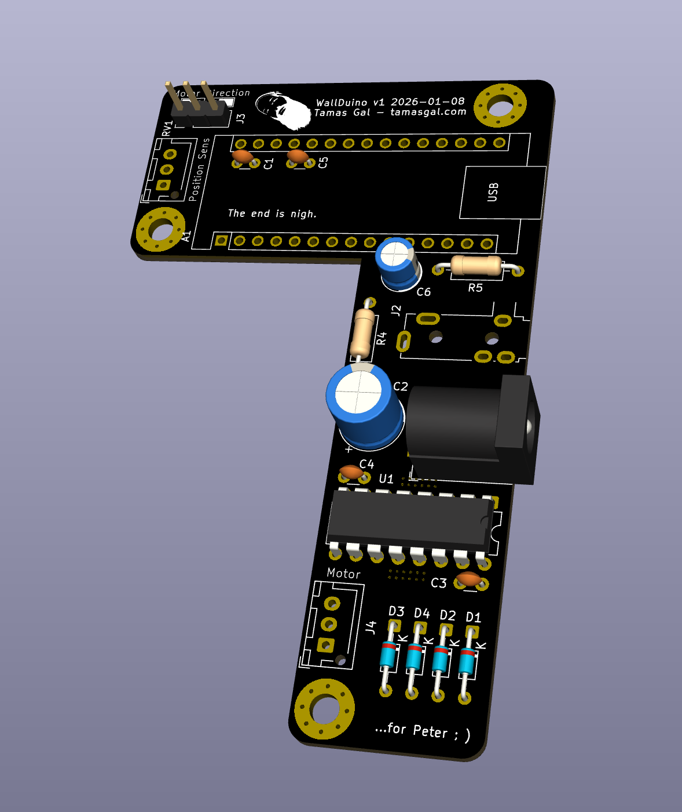

# WallDuino

Drop-in replacement board for the WallWizard remote-controlled TV wall mount
including PCB, DIY veroboard (stripboard) layouts and an open source firmware
for Arduino compatible microcontrollers.

Manual: [`WallDuino_Manual.pdf`](https://github.com/tamasgal/wallduino/blob/main/docs/WallDuino_Manual.pdf)

## Firmware

Board: Arduino Nano compatible
Dependency: [Arduino-IRRemote v4.5](https://github.com/Arduino-IRremote/Arduino-IRremote)
Code: `firmware/WallDuino`

### Changelog

#### v1.1 - 2026-01-22

- Persistent presets after reboot
- Home button support to "go home"

#### v1.0 - 2026-01-09

Initial release

## PCB

### v1.0 (Rev A) 2026-01-08

First release.

### v1.0 (Rev B) 2026-01-21

- Heat sinking of the L293D improved significantly
- R1, R2 and R3 removed
- Added an additional capacitor to smooth out the position sensor signal from the potentiometer

## DIY Veroboard
